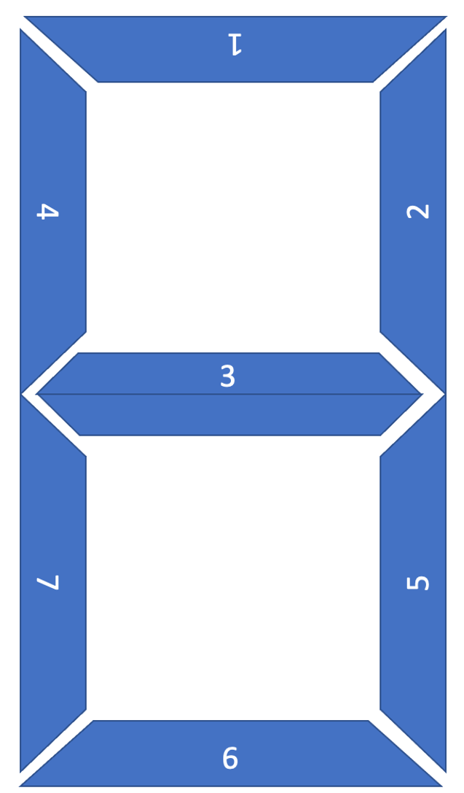
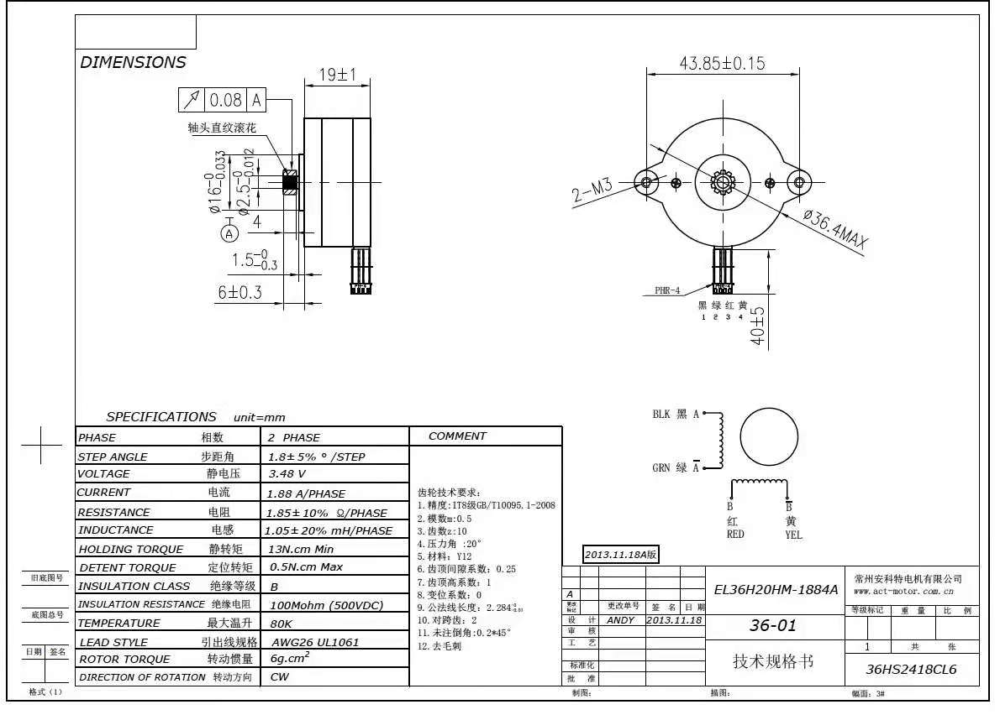

# Motor_clock

## Day 1:

看到了链接觉得很好玩，想自己搞一个。

首先考虑到静音的需求，企图使用小步进，配合TMC202x控制芯片来用。

感谢 *小山嘉* 提供步进电机链接，使用拆机小型步进，成本很低。

发现问题在于TMC202x成本过高。

考虑到每个电机只需要两个状态，打算使用双稳态电磁阀 

发现一个视频：

[Mechnical Design](httNs://www.youtube.com/watch?v=ukRGbEUAVtM&feature=youtu.be)

打算搞这个曲线就可以用最多6个电机完成控制。

## Day 2:

和 *李金时* 一起研究机械结构，发现一些问题

1. 如果将连杆固结在数字轴中心，，数字翻动时会导致连杆的上下运动，所以使用凸轮结构。
2. 发现上述视频里的方形数字有点儿丑，想采用菱形和梯形数字，但是菱形和梯形数字在转动时出现干涉的现象，所以对干涉的问题进行研究。

### 参数初步规定：

连杆内拉3mm从隐藏变为显示，杆直径2mm，凸轮壁厚1mm

### 凸轮设计：

记为放下状态(不显示)，为拉入状态（显示）

每$36^{\circ}$ 为一个变化时段，如果在该时段与下一时段交界处发生状态转变，则该时段最后$\Delta \theta$与下一时段$\Delta \theta$用于状态转变,对秒，$\Delta \theta = 10^{\circ}$;对分钟和小时,$\Delta \theta = 20^{\circ}$

| 编号/时序 |  1   | 2    | 3    | 4    | 5    | 6    | 7    | 8    | 9    | 0    |
| :-------: | :--: | ---- | ---- | ---- | ---- | ---- | ---- | ---- | ---- | ---- |
|     1     |  N   | P    | P    | N    | P    | P    | P    | P    | P    | P    |
|     2     |  P   | P    | P    | P    | N    | N    | P    | P    | P    | P    |
|     3     |  N   | P    | P    | P    | P    | P    | N    | P    | P    | N    |
|     4     |  N   | N    | N    | P    | P    | P    | N    | P    | P    | P    |
|     5     |  P   | N    | P    | P    | P    | P    | P    | P    | P    | P    |
|     6     |  N   | P    | P    | N    | P    | P    | N    | P    | P    | P    |
|     7     |  N   | P    | N    | N    | N    | P    | N    | P    | N    | P    |

利用上述表格进行绘图，思考一番决定使用Matlab多项式拟合极坐标方程，$10^{\circ}$给一个点

发现完全没有必要，直接拿sw做，过渡处使用两段切线弧过渡

在一番苦战之后，终于把凸轮搞定了，下面将基于该尺寸完善连杆机构

## Day 3:

开始着手设计PCB，打算先拿一个板子，把配置都配好，在最终控制板上不再使用引脚配置TMC2208，

可以使用的其他电机驱动（A4998 TB6612FNG）

### PCB Design

考虑到电机供电问题，考虑使用电池供电,可通过外接电源切换

考虑到凸轮转动方向不变，可以将DIR全部共起来，同时考虑到秒针，分针时针凸轮转动频率相同，使用6个PWM引脚就可以，用PCA9685 I2C模拟PWM

时钟使用DS3231

## Day 4:

 意识到电机数量太多，功率较高，需要考虑怎么画转换电路，感谢 *高一川 梁迪轩* 的帮助

发现PCA9685 I2C模拟PWM的问题：输出PWM的频率都是相同的，这无法用于步进电机控制，所以用PCA来处理时钟和分钟8路PWM，秒针单独用两路PWM

## Day 5

发现DC5525可以通过机械结构直接断开内部电路，不同担心转换电路了,但是考虑到一个问题是，如果电源不是从DC005拔掉而是从插线板拔掉就出问题？

## Day 6

先把电机调通搞一套初步能用的代码，再继续画板子。

TMC2208可以使用USART模式（高级设置），也可以是向A4988那样使用简单的PWM输入，打算使用后者。但是电机第一次没有成功起转。后来发现应该将PDN引脚拉低，同时EN与单片机GND连接。

电机转动不太正常，主要的可能是该步进电机的额定电流未知，没有设置的比较好，打算买好一点的电机，再进行调试。

#### 学习用热风枪焊接IC

锡量极其重要，不要放太多，不然引脚大概率粘接

风速不能太低，不然多余焊锡熔而不走，也容易造成粘接

## Day 7

把电机调好了，真坑爹啊，以后一定要看清文档，M1A，M1B接的是一个绕组

Arduino delayMicrosecond 是微秒！

和李金时看了第一版结构，余量不足，无法装配

发现使用PCA9685的问题：如果使用PCA9685内部时钟，漂移可能会非常严重，如果使用外部时钟，配置困难且难以保证I2C正常工作，最终决定将电机驱动直接挂在GPIO上

在kicad里修改完footprint需要开一个新的lib保存，不然可能无法生效

开始layout了

## Day 8

layout好了，有几个问题需要思考：电机开环如何复位

准备使用红外对管进行复位

对于接地问题的讨论[接地](http://blog.sina.com.cn/s/blog_6471e1bb0100mrjp.html)

## Day 9

打样测试

## Day 10

考虑代码构建，使用状态机

[参考](https://learn.adafruit.com/multi-tasking-the-arduino-part-1)

每个loop先判断状态，用flag标记每个电机状态，然后用在mills执行相应动作

对于不同位置的电机设置不同的interval实现转动速度的控制

需要设计不同的细分

[millis rollover](https://arduino.stackexchange.com/questions/12587/how-can-i-handle-the-millis-rollover/12588#12588)

考虑一种处理溢出的方法：手写高精度,但实际上

[This is not a problem](https://www.gammon.com.au/millis)

## Day11

处理归零问题，机械归零不太好，设计了一种对管的方案：

使用一个狭缝，对对管的发射进行限制，然后在转盘上设计狭窄突出，与狭缝配合，提高精度，但是考虑到读取精度可能不高，而且加工精度也达不到很高，遂放弃该方案

采用磁编码器，使用AS5600，考虑到淘宝没有能够适用电机尺寸的PCB，打算自己设计

打算使用角块的方式进行盒子的装配，这样可以使装配变得简单

AS5600 不能设I2C地址，无语子

貌似AS5600L可以，但是也没说怎么设？ 无语子

*高一川* 给出针对I2C无法修改地址的应对策略，使用TCA9548A，非常有价值

## Day 12

第一次设计的PCB到了，有一个元件没有贴，极其难受，先尝试烧录程序，并调试DS3231

第一版板子的问题：

LED_Pin不在PWM引脚，修改DIR

没贴全

USB画反了，USB有没有画反取决于引脚顺序，而不是外形

软件部分，buffer难以清空，想写一个依靠串口进行初始化的程序。

## Day 13

画AS5600pcb

修改第一版PCB，bug极多

1. ICSP接法：不是把一个的ICSP完全接到另一个的ICSP，targetRESET接法不一样！！！！！！需要接到10上
2. 不要在TX，RX上做LED，会让电压漂移
3. DTR必须接，不然不work，必须在DTR引脚到RESET之间串100nF电容，不然不work
4. CR3202 封装有问题

## Day14

调试第一版PCB，所用功能均正常

修改第一版PCB

1. 删去了DS3231的reset按钮，与MCU共RESET
2. PDN 直接接地
3. 加入了编码器接口
4. 加入蜂鸣器
5. 删去了无用的丝印
6. 修正了第一版的bug

机械装配遇到困难，采用数字板和连杆使用金属加工，其他部分3D打印的加工方式

## Day 15

讨论新的机械加工方案，打算使用齿轮传动，用固定座上的齿条驱动零件转动，但是加工仍然存在困难，考虑将元件放大两倍。

讨论盒子的设计方案

## Day 16

打印第二版零件，框加工有点儿贵，打算买现成的

南方小厂小批零件加工比北方大厂便宜很多，铝合金可直接激光切

## Day 17

调试第二版电路板，装配第二版机械零件。

第二版电路板控制部分工作正常，电源模块有问题，插上DC口出现烧坏的迹象，同时插入USB开始冒烟。4.7uH 电感挂了.

可能原因：电感许可电流太小，这是有可能的，在带LED之后确实需要比较大的电流输入，但是问题是没有接LED也挂了。 

六个电机接好，有一个不转，检查多次后无果，*夏博文* 提供帮助，发现是焊接connector时灌入过多的锡，导致connector在正面短路，焊接时一定要注意不能灌锡，应该尽量在一侧形成焊点。

六个编码器有一个不工作，怀疑是芯片的问题，打算重新做芯片

第三版软硬件修改：

1. 取消DS3231 RESET，实现一次上电一直记时的效果，对应的，把软件改成开机读取现在的时间，然后机械对钟。
2. 设置串口中断，只在接受到特定信号的时候进行DS3231设置
3. 将DIR换到非PWM引脚
4. 重画Buzzer电路，GPIO直接推不动

修改机械，使用内螺纹圆柱

内螺纹圆柱销 内径4x12x M3 100

M3x10 200个

## Day 18 19

重新修改机械结构，积累如下经验
==3D打印尽量设计螺丝固定等机构,尽可能少设计拼插==

==尽可能不要设计内槽道等结构，容易因为支撑等原因造成较大的误差==

==3D打印出的孔需要过一遍钻来保证精度==

==可以把层状3维结构拆分成2维，便于加工==

==sw建模使用树状装配体结构，将配合放在文件夹中便于修改，不要野配合==

==可以在适当的位置打孔，从而节省外包3D打印成本==

和李金时一起修3D打印机，

## Day 20
和nlc一起改了板子，主要是修改了电感的封装，新的板子功能正常。  
机械机构方面,nlc对齿条进行了两次修改，第一次延长了齿条长度，但是发现这个修改并不能解决啮合的问题，因此尝试将齿条整体抬高0.3mm，但是出现了上面的齿轮和齿条卡住的情况，对此，解决方案是把齿轮的高度下调一些。

## Day 21

- 发现一个大bug，凸轮结构控制滑块，考虑到每一层轨道控制的滑块要顺延90度，对应的轨道应该也转90度。

## Day 22

- nlc对底座进行了加强，避免了因底座在受力的情况下发生弯曲进而导致滑齿。

- ylw同学为了降低摩擦力非法使用了WD40，特此通报批评。

- wbc同学在调试过程中烧坏TMC2208一枚，工程经验又++。

## Day 23

- 302的门开了，nlc与wbc组装了一个完整的数字，调试顺利，而且噪声比预想的小很多。TMC2209的扭矩还是足够的。
  
  (https://youtube.com/shorts/_J2np6-Vw0g?feature=share)
  
 - 依然存在的问题&解决方案

    - 齿轮偶尔存在打滑的现象，原因可能是铜柱松动。由于无法精确设计铜柱的孔径大小，决定在竖直方向开孔，用M3螺丝锁住铜柱

### 资料整理

[机械结构设计](httNs://www.youtube.com/watch?v=ukRGbEUAVtM&feature=youtu.be)

[TMC2208驱动](https://wiki.fysetc.com)

[TMC 接线](https://blog.csdn.net/weixin_42740222/article/details/88637535)

[Arduino TMC2208 lib](https://www.arduino.cc/reference/en/libraries/tmc2208stepper/)

[PCA9685电路设计](https://wenku.baidu.com/view/826d0d257c1cfad6185fa75c.html)

[PCA Arduino](https://learn.adafruit.com/16-channel-pwm-servo-driver/hooking-it-up)

[转换电路](https://www.eet-china.com/mp/a33537.html)

[DC5525](https://ask.zol.com.cn/x/5491238.html)

[Pin Mapping](https://www.arduino.cc/en/Hacking/PinMapping168)

[ATmega 328P-AU](https://forum.arduino.cc/t/atmega328-au/550838)

[Adafruit](https://learn.adafruit.com)

[AS5600](https://ams.com/as5600#tab/description)

[AS5600L](https://ams.com/documents/20143/36005/AS5600L_DS000545_3-00.pdf/7ade6878-7a32-2294-b88d-479d50fab6de)

[TCA9548](https://learn.adafruit.com/adafruit-tca9548a-1-to-8-i2c-multiplexer-breakout/downloads)

[I2C上拉电阻](https://www.zlg.cn/ipc/article/detail/id/690.html)

### 开销

中性笔(x)

买电机驱动模块 6个(x)

Niextube

嘉里创元件费（x）

云汉芯城元件费(x)

板子（x）

转接头（x）

DS3231模块(第一次)

DS3231模块(第二次) 

3D打印（200）

TCA9548A 模块

TPS561208DDCR

AS560 芯片(第一次)(x)

AS5600 芯片(第二次)

TCA9548A 芯片（30）

立创商城元件(x)

LED板（x）

第二次机械加工（860）

金属动板 (150)

嘉立创邮寄元件：TPS561208DDCR，TCA9548A(x), CH340G(x), 

WS2812(3m)(x)

邮寄处理费(x)

老铁：

中午吃饭. 51.5 (x)

《网络是怎样连接的》 91.64(x)

