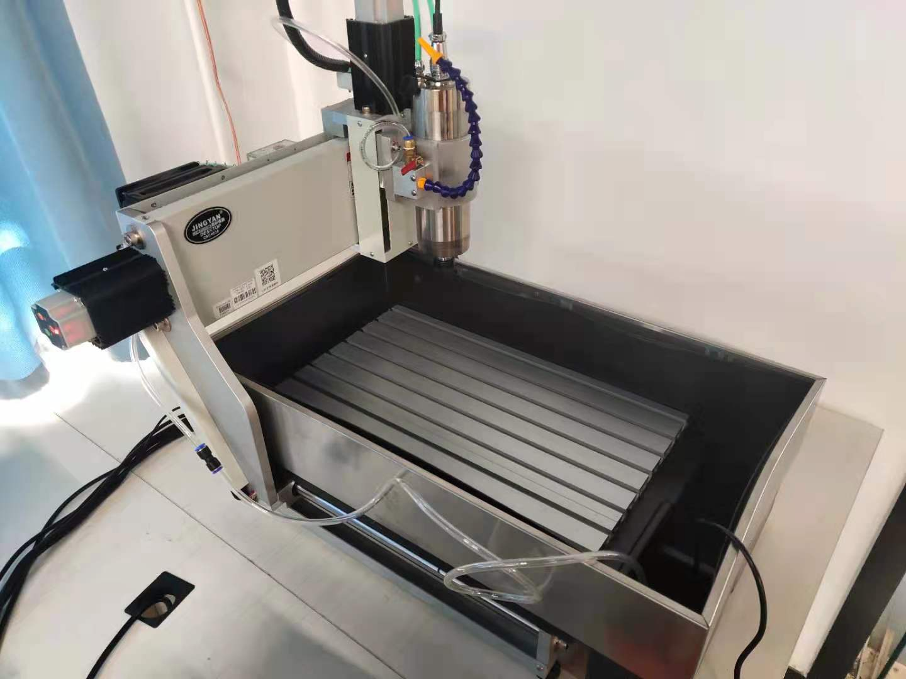

# CNC调试记录

从AIR获得工控机

必须使用并口通信，由于主机并没有并口，使用PCI转并口

驱动一开始打算在官网下载，但是官网驱动不能在英文环境下安装，遂直接使用网络在设备管理器中更新驱动，实现目标。

一开始使用windows 7 64bit，无法工作，于是使用32bit系统

换成32bit系统自后，按照说明破解之后，启动后黑屏

Mach3 破解版总是出现问题，最终打算使用Linux CNC


Linux CNC坑也多，学习学习视频准备实操，把xml导入Mach读出配置，按此配置设置，不work

最后换用旧CNC主板，work，但是Home不对


AXIS is the default GUI

最新：

配置里的BothLimits and HOME 是指home switch，问题是：我们的机子上是否有home switch

一个limit switch可以被用作home switch

MDI stands for manual data input

Modes of operation:

Homing can only be excuted in manual mode

Run a full gcode can only be done in auto mode


G53：机械坐标，在homing后把Home的点设置成原点

FeedoverRide 类似于速度超调

搞清楚 **Coordinate Display**

和 Manual Control


目前还有不太理解的问题就是坐标的问题和换刀具的问题


### Gcode

Gcode 的structure:

Program -> lines -> word

Words

G90 : 绝对坐标

```gcode
G90
G0 X2.5(rapid move to coordinate X2.5 including any offsets in effect)
```

G91: 相对坐标

```gcode
G91 (set incremental distance mode)
G0 X2.5 (rapid move 2.5 from current position along the X axis)
```

M2 M30 :终止程序

G1 : Linear Motion

```gcode
G90 (set absolute distance mode)
G1 X1.2 Y-3 F10 (linear move at a feed rate of 10 from current position to X1.2 Y-3)
Z-2.3 (linear move at same feed rate from current position to Z-2.3)
Z1 F25 (linear move at a feed rate of 25 from current position to Z1)
M2 (end program)
```


- N040 G53 X0 Y0 Z0 回到原点


[Homing](http://linuxcnc.org/docs/2.4/html/config_ini_homing.html)

在home的速度上有个tradeoff，如果过于快，可能会撞到限位上，如果过于慢，会等待很长时间


## Home



如上图，这是一开始机器的home的位置，每次home后机器会回到这一点，然后将此点处坐标标记成（0，0，0），然后在接下来的运动中，机器只能在0 - Max范围内移动，然而bug在于，三轴继续正向移动只会触发限位开关，所以三轴实际上无法进一步移动，这个bug让我反思stepconf中每个轴配置中的Home location, table travel, home switch location 这几个量

首先更改home location 在更改之后，仍然运动到限位开关处，但是此点处坐标不再是(0,0,0)而是home location的值，而机器的行程仍然是0-Max，这使得三轴不再是被卡到home处，通过这个也知道了table travel中的值正是基于G53坐标的

思考CNC总是回到A点而不是B点的原因，想到一种可能的原因：我们没有home switch，所以机器只能朝一个方向试探，在试探过程汇总trip到了limit switch，于是在A点停止，能否通过更改试探的方向，使得机器能在B点home呢？因为我想使用正的坐标，这样可以对后续的G code采用的坐标系统进行一个sanity check 

在stepconf 中修改了home search Velocity ，将其调成负值

它    W   O.   R.     K 了！

由于我们使用的4060CNC在触发Limit switch 的时候会自动向后移动一个固定offset，所以不必担心serach velocity带来的问题，可以把它调大一点儿


### Gcode converter

https://listoffreeware.com/free-dxf-to-gcode-converter-software-windows/
